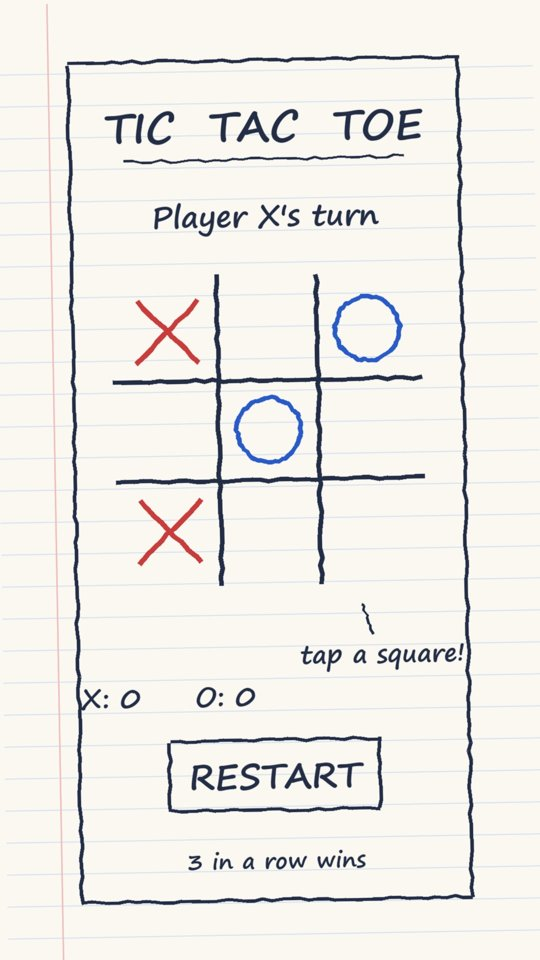
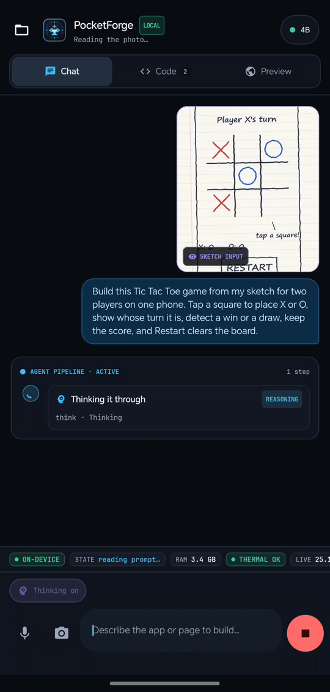
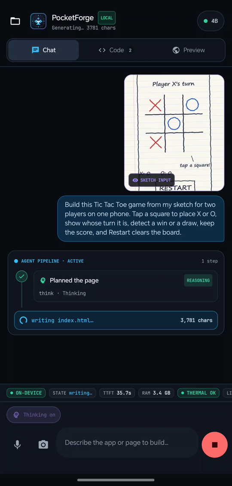
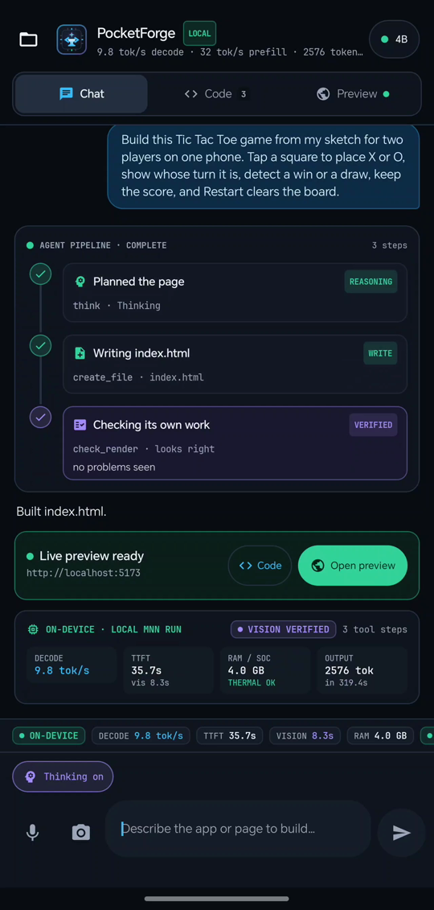
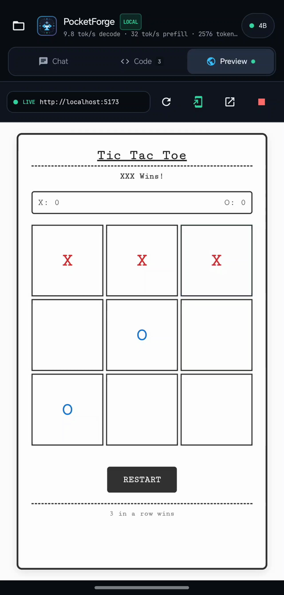
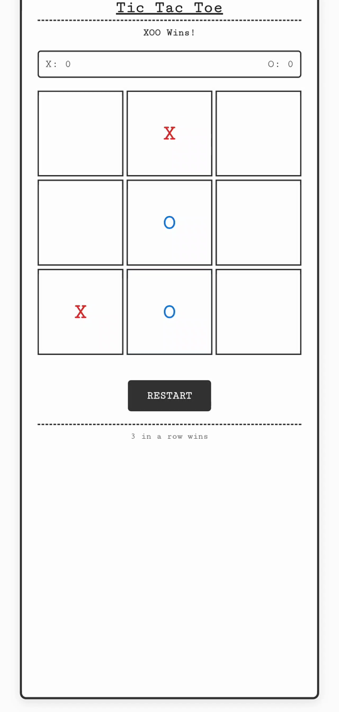
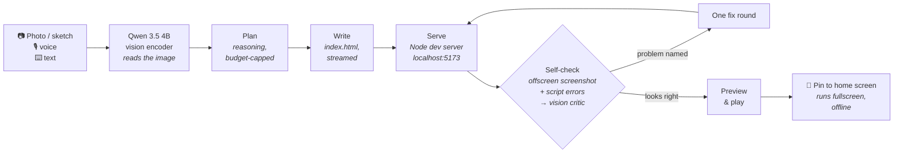
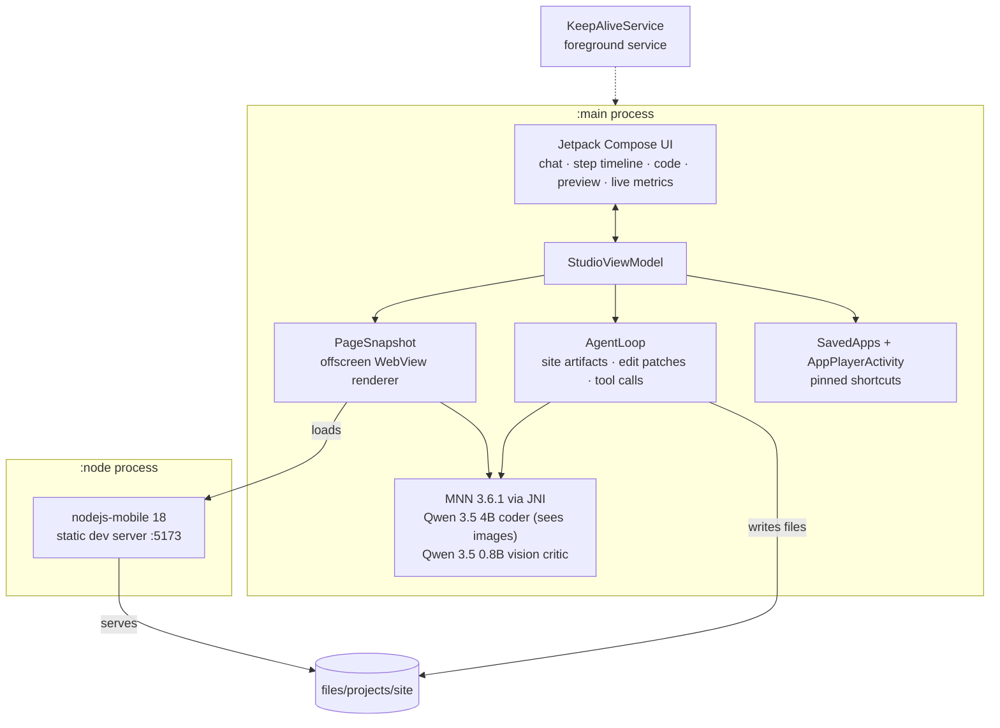
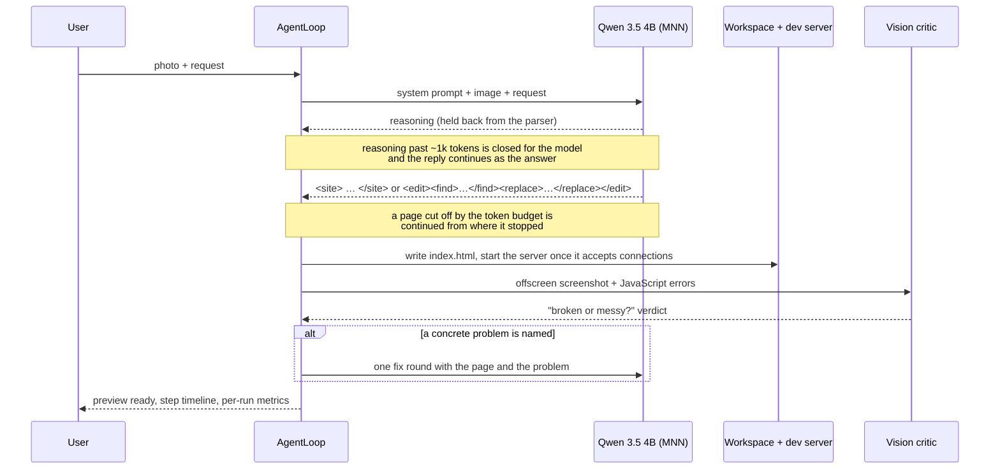

# PocketForge

**On-device AI that turns your ideas into working apps, right on your phone.**

Photograph a hand-drawn sketch (or type or speak an idea), and PocketForge's local model plans the
app, writes it, runs it, checks its own output, and pins the finished app to your home screen.
The models run on the phone itself: no cloud API, no laptop.

**[Download the APK](https://github.com/srideep47/pocketforge-prototype/releases/latest)** ·
**[Watch the 1:44 demo](https://github.com/srideep47/pocketforge-prototype/releases/latest)**
(the release carries `PocketForge_demo.mp4`) · Team Zero Latency · iQOO Hackathon 2026 · Developer Tools

<p align="center">
  
  &nbsp;→&nbsp;
  
  
  
  &nbsp;→&nbsp;
  
  
</p>

<p align="center"><sub>Real screenshots from the demo run on a Snapdragon 8 Elite phone: sketch → reading and
planning → writing → self-check → playing → the app opened from its own home-screen icon.</sub></p>

---

## What a run looks like

Measured on a Snapdragon 8 Elite phone with 12 GB RAM (about 5 GB of it free), Qwen 3.5 4B on the CPU:

| Input | Result | Time | Output | Decode | Peak RAM | Self-check |
|---|---|---|---|---|---|---|
| Hand-drawn Tic-Tac-Toe sketch + one sentence | Playable 2-player game with turns, win detection, restart | **5 min 19 s** | 2,576 tokens | 9.8 tok/s | 4.1 GB | passed |
| Screenshot of a phone calculator + "copy it closely" | Same key grid, orange `=`, working arithmetic (7 × 8 = 56) | 5 min 34 s, +10 min fix round | 5,936 tokens | 9.2 tok/s | 4.6 GB | flagged an empty display, fixed |
| "A dark landing page for a coffee shop" (text only) | Styled single-page site | 1 min 55 s | 1,179 tokens | 11.5 tok/s | 3.8 GB | not run (earlier build) |

Times are from pressing Send to a playable page, including reading the image, planning, writing
and the self-check. The demo video is a real screen recording with the waiting parts sped up and
labelled; a live "real time" clock stays on screen throughout.

## How it works



Everything in that diagram runs on the phone. A network connection is needed only to download the
models the first time.

### On the phone



Node lives in its own process because `node::Start` never returns and takes its process down if V8
faults: a broken dev server costs a server restart, not the gigabytes of loaded model.

### Inside one agent turn



## Features

| | |
|---|---|
| **Photo, camera, voice or text in** | Attach a sketch, wireframe or screenshot from the camera or the gallery. The 4B coder reads it with its own vision encoder. Dictation uses Android's `SpeechRecognizer`, on-device where the phone supports it. |
| **Plans before it writes** | Qwen 3.5's reasoning mode, with the reasoning kept out of the tool parser and closed automatically once it has planned enough. On device this made photo-to-app runs about 3× faster *and* more accurate than no reasoning, because the model stops writing bloated pages that run out of budget. |
| **Complete, self-contained pages** | The model returns one raw `<site>…</site>` document, not JSON-escaped code, which small models get wrong. External links and CDN scripts are stripped: the preview is offline. |
| **Cheap edits** | A follow-up change can come back as `<edit><find>/<replace>` patches applied to the current page; if any find does not match, the model is asked for the full page instead. |
| **Checks its own work** | The page is rendered in an offscreen WebView, screenshotted, and judged by a small on-device vision model; script errors from the page are added to the list. One automatic fix round at most. |
| **Runs the app** | nodejs-mobile serves the project on `localhost:5173` with live reload; the Preview tab shows it in a WebView. |
| **Pin to home screen** | Freezes the page into its own copy and pins a launcher shortcut whose icon is a miniature of the app. It opens fullscreen with no dev server, no model and no network. |
| **Live, honest metrics** | Time to first token, prefill and decode tok/s, peak RAM, thermal state, offline status and the current phase, from MNN's own counters. Every step in the timeline records its duration. |
| **Mini IDE** | Project tree with create, rename and delete, file tabs and a syntax-highlighted editor. |
| **Survives the background** | A foreground service keeps a ~4 GB process alive while the camera app is open, so taking a photo does not lose the loaded model. |

## Install

1. Download `PocketForge-v0.2.0.apk` from [Releases](https://github.com/srideep47/pocketforge-prototype/releases/latest) and install it (arm64, Android 10+).
2. Open PocketForge, tap **No model** and download **Qwen 3.5 · 4B** (2.8 GB) and **Qwen 3.5 · 0.8B vision** (0.5 GB) over Wi-Fi. Downloads resume if interrupted.
3. Tap **Use** on the 4B. From here on it works in airplane mode.

It needs a phone with a recent flagship chip and about 4.5 GB of free RAM; it was developed and
measured on a Snapdragon 8 Elite. Qwen 3.5 · 2B is offered for phones with less memory.

## Models

| Model | Role | Size | Source |
|---|---|---|---|
| Qwen 3.5 4B | Coder: reads images, plans, writes the page (recommended) | 2.8 GB | [`taobao-mnn/Qwen3.5-4B-MNN`](https://huggingface.co/taobao-mnn/Qwen3.5-4B-MNN) |
| Qwen 3.5 2B | Faster coder for phones with less RAM | 1.4 GB | [`taobao-mnn/Qwen3.5-2B-MNN`](https://huggingface.co/taobao-mnn/Qwen3.5-2B-MNN) |
| Qwen 3.5 0.8B | Vision critic for the self-check; reads sketches for coders that cannot see | 0.5 GB | [`taobao-mnn/Qwen3.5-0.8B-MNN`](https://huggingface.co/taobao-mnn/Qwen3.5-0.8B-MNN) |

Runtime settings are written at load time by `ModelConfig`: 16k context for the 4B, weights
memory-mapped from storage, mixed sampler (temperature 0.6 for code), and Qwen's chat template
with thinking on by default (toggle in the composer).

## Lessons from the device

Things that only showed up on real hardware, and what the code does about them:

- **Unbounded reasoning never finishes.** Left alone, the 4B reasoned through its whole 8k-token budget (~17 min) without writing the page. The loop now closes the thought after ~1k tokens and continues the reply as the answer (`nativeContinueChatStream`).
- **No reasoning is worse, not faster.** Without it the model wrote 6–11k-character pages that ran past the budget on every attempt. A cut-off page is now continued from where it stopped instead of regenerated, and runaway pages are abandoned.
- **Looks right ≠ works.** A calculator matched its screenshot perfectly while its `×` key sent a symbol the script never handled. The prompt now makes the model trace one real interaction, and the self-check reports script errors.
- **JNI and emoji.** `NewStringUTF` aborts on 4-byte emoji and on characters split across tokens. Text now crosses the boundary as UTF-16, emitting only complete code points.
- **Heat is a real limit.** After about an hour of back-to-back runs the phone throttles and decode falls from ~11 to ~6 tok/s.

## Limitations

- One single-page web app (HTML, CSS and JavaScript in one file) per project, rendered in a WebView. No native Android apps yet.
- About 5 minutes per app on a Snapdragon 8 Elite, on the CPU. The Hexagon NPU is not used yet.
- A 4B model gets simple, well-known apps right (calculators, Tic-Tac-Toe, timers, landing pages) and can get game logic wrong: a Whack-a-Mole attempt looked right but did not play.
- Edits often still rewrite the whole page rather than patching it.
- arm64 only; needs roughly 4.5 GB of free RAM for the 4B.

## Roadmap

- Vision encoder and prompt reading on the **Snapdragon NPU**, to cut the ~30 s before the first token.
- Multi-screen apps with local storage, and a "doodle → game" mode with touch controls.
- Sharing a built app to another phone.
- A laptop workflow over iQOO's Office Kit: mirror the phone to review code, drag projects across.
- Larger low-bit models (a 1-bit 27B fits in about 3.8 GB) once they run fast enough on phone CPUs and NPUs.

## Build from source

```bash
./gradlew :app:assembleDebug     # installs as "PocketForge Dev" (com.srideep.pocketforge.dev)
./gradlew :app:assembleRelease   # needs keystore.properties, see below
```

Requirements: JDK 17, Android SDK 35, NDK 27+, CMake 3.22.1, and `mnnSourceRoot` in
`gradle.properties` pointing at an MNN checkout (headers only: `include/` and
`transformers/llm/engine/include/`; the matching `libMNN.so` is vendored).

Release builds are signed with the key named in an untracked `keystore.properties`
(`storeFile`, `storePassword`, `keyAlias`, `keyPassword`). Without it, `assembleRelease` produces an
unsigned APK.

### Vendored binaries

- `engine/mnn/src/main/jniLibs/arm64-v8a/libMNN.so`: MNN 3.6.1 with the LLM runtime
- `runtime/node/src/main/jniLibs/arm64-v8a/libnode.so`: nodejs-mobile 18.20.4
- `runtime/node/src/main/cpp/include/node/`: the matching embedding headers

`libMNN.so` and the `mnnSourceRoot` headers must stay in step with each other.

## Layout

```
app/
  agent/       AgentLoop, prompts, <site>/<edit> artifacts, tool-call parser, tools
  chat/        StudioViewModel and UI state (steps, phases, metrics)
  vision/      photo preparation, vision critic, render verdicts
  preview/     offscreen page snapshots
  apps/        saved apps, pinned shortcuts, fullscreen player
  model/       model catalog and resumable downloader
  metrics/     device metrics (RAM, thermal, network)
  voice/       on-device dictation
  ui/          Compose screens: chat timeline, editor, preview, model sheet, metrics bar
engine/mnn/    JNI bridge (llm_jni.cpp) + Kotlin streaming engine
runtime/node/  nodejs-mobile host, :node service, dev server
```

## Team

**Team Zero Latency**: Srideep Chand Alla · iQOO Hackathon 2026, Developer Tools track.
